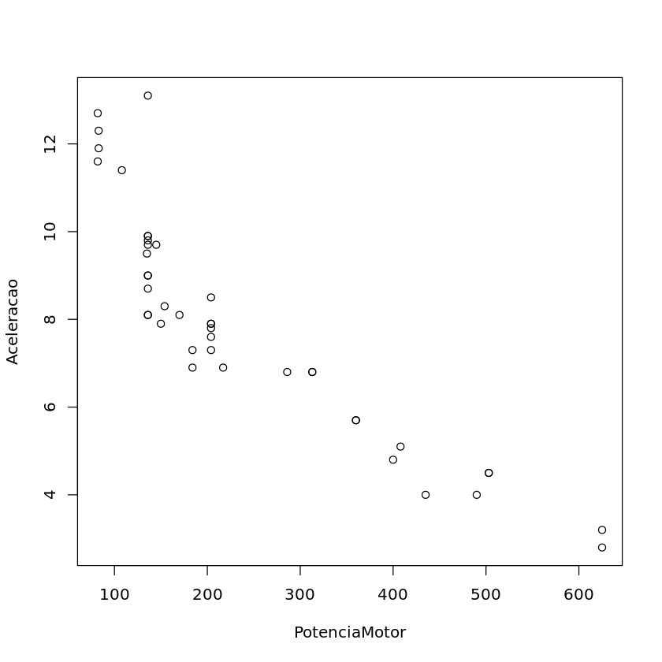
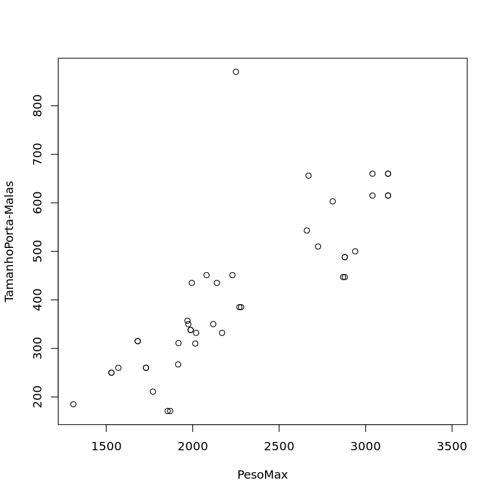
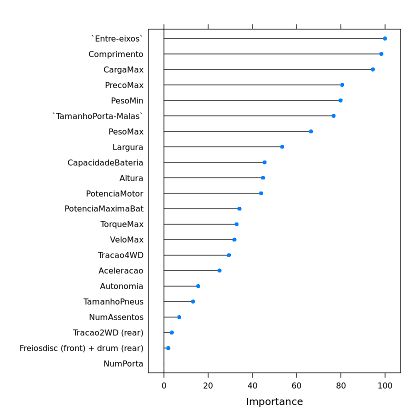

# Previsão de Consumo de Energia de Carros Elétricos

## Introdução

O objetivo desse projeto é criar um modelo de Machine Learning para prever o consumo de energia de um carro elétrico. Para isso, foi utilizado dados do [Mendeley Data](https://data.mendeley.com/datasets/tb9yrptydn/2).

## Sumário

- [Extração dos dados](./Scripts/extracao.py)
- [Processamento de Dados](./Notebook/Processamento.ipynb)
- [Modelo de Machine Learning](./Notebook/Modelagem.ipynb)

## Limpeza dos dados

Em um primeiro momento, foi feita a limpeza dos dados. Para isso, houve um trabalho de renomeação das colunas para facilitar o trabalho futuro, mudança na tipagem das colunas e de verificação sobre os valores nulos. Durante esta ultima etapa, foi verificado que havia uma quantidade substancial de valores nulos de acordo com a tabela abaixo:

| Coluna                       | Quantidade   |
| ---------------------------- | ------------ |
| Consumo Médio de Energia    | 9            |
| Peso Máximo do Carro        | 8            |
| Carga Máxima                | 8            |
| Aceleração de 0 a 100 km/h | 3            |
| Tipo de Freio                | 1            |
| Volume do Porta Malas        | 1            |
| **Total**              | **30** |

Como o consumo médio de energia é o valor que queremos prever, foi decidido que as linhas com valores nulos seriam removidas afetando algumas outras colunas, ficando:

| Coluna                       | Quantidade  |
| ---------------------------- | ----------- |
| Aceleração de 0 a 100 km/h | 2           |
| Tipo de Freio                | 1           |
| Volume do Porta Malas        | 1           |
| **Total**              | **4** |

Para a coluna 'Tipo de Freios', foi observado que cerca de 83% dos carros tinham freio a disco tanto na frente quanto atrás, assim foi imputado esse valor para o caso nulo. O caso da aceleração e do volume do porta malas foi um pouco mais complexo. Como o conjunto de dados disponível era relativamente pequeno, houve uma necessidade de evitar a perda de informações. Dessa forma, foi feita uma análise mais aprofundada para tentar descobrir alguma relação entre essas colunas com as demais com o objetivo de criar um modelo que impute os valores nulos.

Para a coluna de aceleração, foi descoberto que o valor desta era parcialmente explicado pela potência do motor através da seguinte regressão linear feita em R:

    Call:
    lm(formula = Aceleracao ~ PotenciaMotor + TorqueMax + CapacidadeBateria +
        Autonomia + PesoMin + PesoMax + VeloMax, data = data)

    Residuals:
        Min       1Q   Median       3Q      Max
    -1.92304 -0.55192 -0.01871  0.71132  1.75397

    Coefficients:
                    Estimate Std. Error t value Pr(>|t|)
    (Intercept)       15.599528   2.382014   6.549 1.68e-07 ***
    PotenciaMotor     -0.013296   0.006352  -2.093   0.0439 *
    TorqueMax          0.001144   0.002896   0.395   0.6953
    CapacidadeBateria  0.053542   0.044554   1.202   0.2378
    Autonomia         -0.009414   0.005168  -1.822   0.0773 .
    PesoMin           -0.004513   0.002586  -1.745   0.0900 .
    PesoMax            0.002862   0.001780   1.608   0.1171

    VeloMax           -0.018555   0.016690  -1.112   0.2740                          
    Signif. codes:  0 ‘***’ 0.001 ‘**’ 0.01 ‘*’ 0.05 ‘.’ 0.1 ‘ ’ 1 

    Residual standard error: 1.055 on 34 degrees of freedom
    (2 observations deleted due to missingness)
    Multiple R-squared:  0.8604,	Adjusted R-squared:  0.8317
    F-statistic: 29.94 on 7 and 34 DF,  p-value: 9.31e-13

O gráfico abaixo pode nos dar uma maior intuição sobre a relação entre a potência do motor e a aceleração:

Dessa forma, foi criado um modelo de regressão linear para prever o valor da aceleração de 0 a 100 km/h a partir da potência do motor e foi feito a imputação dos valores nulos.

Para o volume do porta malas, foi seguido a mesma metodologia que determinou uma forte relação entre o volume do porta malas e o peso máximo do carro. Dessa forma, foi criado um modelo de regressão linear para prever o valor do volume do porta malas a partir do peso máximo do carro e foi feito a imputação dos valores nulos. O gráfico abaixo e o resumo do modelo de regressão linear criado podem nos dar uma maior intuição sobre a relação entre o peso máximo do carro e o volume do porta malas:

    Call:
    lm(formula =`TamanhoPorta-Malas` ~ PesoMin + PesoMax + `Entre-eixos`,
        data = data)

    Residuals:
        Min      1Q  Median      3Q     Max
    -130.67  -42.83   -9.21   40.87  402.99

    Coefficients:
                Estimate Std. Error t value Pr(>|t|)
    (Intercept)   -406.0595   249.7509  -1.626  0.11203
    PesoMin         -0.2480     0.1486  -1.669  0.10320
    PesoMax          0.4060     0.1465   2.772  0.00851 **

    `Entre-eixos`    1.3004     1.3070   0.995  0.32588                            
    Signif. codes:  0 ‘***’ 0.001 ‘**’ 0.01 ‘*’ 0.05 ‘.’ 0.1 ‘ ’ 1 

    Residual standard error: 92.35 on 39 degrees of freedom
    (1 observation deleted due to missingness)
    Multiple R-squared:  0.6955,	Adjusted R-squared:  0.6721
    F-statistic: 29.69 on 3 and 39 DF,  p-value: 3.647e-10

## Modelagem

Dado ao grande número de variáveis em frente a quantidade de observações, houve uma grande preocupação em evitar o overfitting, assim foi feito um processo de seleção de variáveis. Para tal, foi utilizado o algoritmo Random Forest já que, além de ser útil para problemas de regressão e classificação, pode ser utilizado para determinar a importância de cada variável. O gráfico abaixo nos mostra a importância de cada variável:

Dessa forma, foi escolhido todas as variáveis que obtinham um valor aproximadamente superior a 70 de relevância para a variável alvo no caso:

- Entre-Eixos
- Comprimento
- Carga Máxima
- Preço Máximo
- Peso Minimo
- Peso Maximo
- Volume do Porta Malas

Na modelagem em si, foi testado multiplos algoritmos sendo:

- Regressão Linear
- Random Forest
- Xgboost
- Support Vector Machine
  - Linear
  - Linear Regularizado
  - Radial
- Regressão Polynomial Regularizada
  - Radial
  - Minimização por Mínimos Quadrados
- k-Nearest Neighbors

O resultado é que os algoritmos K-Nearest Neighbors, Xgboost e Regressão Polynomial Regularizada de Minimos Quadrados foram os que obtiveram os piores resultados. Os demais obtiveram resultados muito próximos assim a escolha de um algoritmo final dependeria do problema de negócio que deseja resolver. Caso seja necessário, por exemplo, um modelo que possa ser interpretado, a Regressão Linear seria uma boa escolha. Dessa forma, não foi decidido um algoritmo final, mas sim, um conjunto de algoritmos que poderiam ser utilizados para resolver problemas parecidos. A tabela abaixo mostra esses algoritmos e suas principais métricas. Vale ressaltar que o nome do modelo é aquele que é utilizado ao treinar usando o pacote Caret.

| Model      | MSE       | RMSE     | MAE      | R2        |
| ---------- | --------- | -------- | -------- | --------- |
| svmRadial  | 2.226849  | 1.492263 | 1.115563 | 0.9733828 |
| svmLinear3 | 2.882738  | 1.697863 | 1.550279 | 0.9723585 |
| svmLinear  | 4.359512  | 2.087944 | 1.781333 | 0.9710662 |
| lm         | 3.212528  | 1.792353 | 1.515733 | 0.9691709 |
| rf         | 2.501950  | 1.581755 | 1.302031 | 0.9649514 |
| krlsRadial | 2.135192  | 1.461230 | 1.154153 | 0.9645024 |
| knn        | 2.420802  | 1.555893 | 1.265432 | 0.9177125 |
| xgbTree    | 3.566847  | 1.888610 | 1.384757 | 0.8543938 |
| krlsPoly   | 15.921817 | 3.990215 | 3.706352 | 0.8458158 |
